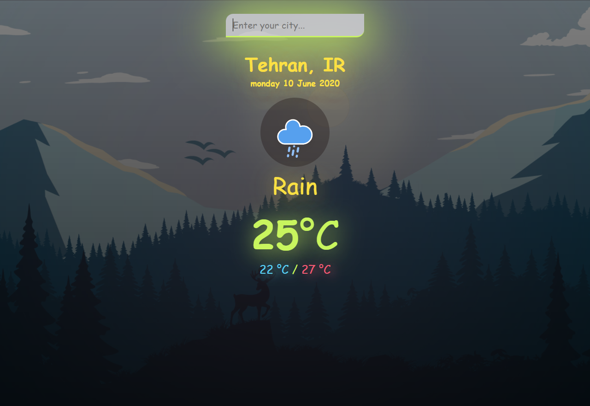

# Weather-app
## Table of contents

- [Overview](#overview)
  - [Screenshot](#screenshot)
  - [Links](#links)
- [My process](#my-process)
  - [Built with](#built-with)

## Overview

### Screenshot




### Links

- Solution URL: [My solution](https://github.com/MiladRostami01/Weather-app)

## My process

### Built with

- Semantic HTML5 markup
- CSS custom properties
- Flexbox
- CSS Grid
- Mobile-first workflow
- [React](https://reactjs.org/) - JS library
- [Next.js](https://nextjs.org/) - React framework
- [Styled Components](https://styled-components.com/) - For styles

To see how you can add code snippets, see below:

```html
// Html
<div class="container">
    <header>
      <input type="text" autocomplete="off" placeholder="Enter your city..." class="search-box">
    </header>
    <main>
      <div class="location">
        <div class="city">Tehran, IR</div>
        <div class="date">monday 10 June 2020</div>
      </div>
      <div class="current">
        <div class="icon">
          
        </div>
        <div class="weather">Rain</div>
        <div class="temp">25<span>°C</span></div>
        <div class="low_hi"><span class="low">22 °C</span> / <span class="hi">27 °C</span> </div>

      </div>
    </main>
  </div>
```
```js
// Js
const api = {
  key: '***', // your APIkey 
  base: 'https://api.openweathermap.org/data/2.5/'
}

document.addEventListener('DOMContentLoaded' , () =>{
  fetch(`${api.base}weather?q=Tehran&units=metric&appid=${api.key}`)
    .then(weather => {
      return weather.json()
    }).then(displayResult)
})

const getDate = () =>{
  let now = new Date()

  const months = ["January", "February", "March", "April", "May", "June", "July", "August", "September", "October", "November", "December"];
  const days = ["Sunday", "Monday", "Tuesday", "Wednesday", "Thursday", "Friday", "Saturday"];

  let day = days[now.getDay()]
  let date = now.getDate()
  let month = months[now.getMonth()]
  let year = now.getFullYear()

  return `${day} ${date} ${month} ${year} `
}
```

## Author

- Website - [Miladrostami01.ir](https://miladrostami01.ir/)
- Instagram- [milad_rostami_01](https://www.instagram.com/milad_rostami_01/)
- linkedin - [Milad Rostami](https://www.linkedin.com/in/miladrostami01/)
